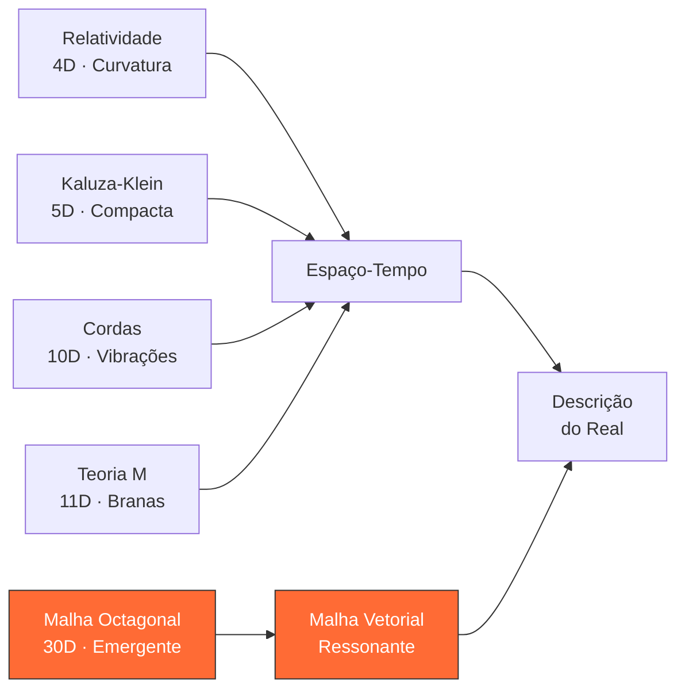

# Comparativo de Modelos Teóricos

> **Teoria da Malha Octagonal Vetorial vs. Modelos da Física Contemporânea**
> Baseado na Tabela Comparativa, Parte III — *Postulados Científicos e Validações Empíricas*

---

## 1. Tabela Comparativa Principal

| Critério | Relatividade Geral | Kaluza-Klein | Teoria das Cordas | Teoria M | **Malha Octagonal** |
|----------|:------------------:|:------------:|:------------------:|:--------:|:-------------------:|
| **Estrutura dimensional** | 4 (3+1) | 5 | 10 | 11 | **Variável, emergente** |
| **Geometria** | Curvatura | Compacta | Cordas | Branas | **Malha vetorial octagonal** |
| **Empiricidade** | Alta | Teórica | Abstrata | Matemática | **Alta (modelo físico)** |
| **Validação experimental** | Confirmada | Não testada | Não testada | Não testada | **Proposta como testável** |
| **Papel do vácuo** | Geométrico | Neutro | Dinâmico | Vibração de fundo | **Estabilizador ativo** ($\omega \cdot \varepsilon_{-}$) |
| **Origem da matéria** | Massa curva o espaço | Propriedade dimensional | Modos vibracionais | Interação de membranas | **Cristalização vetorial** |

---

## 2. Análise Detalhada por Critério

### 2.1. Estrutura Dimensional

| Modelo | Nº de Dimensões | Natureza |
|--------|:---------------:|----------|
| Relatividade Geral | 4 | Fixas (3 espaciais + 1 temporal) |
| Kaluza-Klein | 5 | 4 observáveis + 1 compactificada |
| Teoria das Cordas | 10 | Maioria compactificadas em escala de Planck |
| Teoria M | 11 | Unificação das 5 versões de cordas |
| **Malha Octagonal** | **30 (emergentes)** | **Surgem por estabilidade vetorial — não são fixas** |

> A Malha Octagonal é o único modelo em que as dimensões **não são postuladas a priori**, mas **emergem** do cumprimento da condição $\omega \cdot \varepsilon_{-} = -1$.

### 2.2. Geometria Fundamental

- **Relatividade:** Espaço-tempo contínuo com curvatura determinada pelo tensor energia-momento $T_{\mu\nu}$
- **Kaluza-Klein:** Dimensão extra circular compactificada para unificar gravidade e eletromagnetismo
- **Cordas:** Objetos unidimensionais (cordas) vibrando em espaço 10D
- **Teoria M:** Membranas (branas) em 11D, generalizando cordas
- **Malha Octagonal:** Rede vetorial tridimensional com topologia octagonal, onde cada célula contém vetores $\vec{M}_{ijk}$ modulados por $\Theta(T)$

### 2.3. Empiricidade e Testabilidade

| Modelo | Nível de Testabilidade | Observação |
|--------|:----------------------:|------------|
| Relatividade | ✅ Alta | Ondas gravitacionais, lentes, GPS |
| Kaluza-Klein | ⚠️ Teórica | Dimensão extra não observada |
| Cordas | ❌ Abstrata | Escala de Planck inacessível |
| Teoria M | ❌ Matemática | Formulação incompleta |
| **Malha Octagonal** | ✅ **Alta** | **Modelo físico mensurável + simulação computacional** |

### 2.4. Papel do Vácuo

A diferença mais significativa entre os modelos reside na interpretação do vácuo:

- **Modelos tradicionais:** O vácuo é passivo (geométrico, neutro) ou resultado emergente (vibrações)
- **Malha Octagonal:** O vácuo é um **estabilizador ativo**, governado pelo campo $\varepsilon_{-}$, que atua como regulador topológico impedindo o colapso dimensional

### 2.5. Origem da Matéria

| Modelo | Mecanismo |
|--------|-----------|
| Relatividade | Massa é fonte de curvatura do espaço-tempo |
| Kaluza-Klein | Matéria como propriedade do espaço 5D |
| Cordas | Partículas como modos vibracionais de cordas |
| Teoria M | Interação entre membranas gera partículas |
| **Malha Octagonal** | **Cristalização vetorial — matéria é estabilidade** |

---

## 3. Vantagens Específicas da Malha Octagonal

### 3.1. Mensuração Real

A laranja fornece uma estrutura empírica mensurável com subdivisões regulares, permitindo reproduzir fisicamente a modelagem vetorial.

### 3.2. Dimensões como Vetores Reais

Diferente de teorias que postulam dimensões extras compactificadas, na Malha Octagonal as dimensões são **derivadas diretamente de vetores tridimensionais** e podem ser quantificadas.

### 3.3. Gravidade como Efeito Secundário

A gravitação é reinterpretada como uma **consequência da expansão ou tensão da malha vetorial**, e não como curvatura geométrica do espaço-tempo.

### 3.4. Critério Objetivo de Validação

A existência de uma dimensão depende do cumprimento do postulado $\omega \cdot \varepsilon_{-} = -1$, oferecendo um **filtro objetivo e computável**.

### 3.5. Aplicabilidade Pedagógica e Experimental

Por ser físico e visual, o modelo permite uso como ferramenta educacional e como proposta de experimentação científica.

---

## 4. Superação dos Marcos Tradicionais

### 4.1. vs. Teoria das Cordas

| Aspecto | Cordas | Malha Octagonal |
|---------|--------|-----------------|
| Dimensões | Compactificadas, não observáveis | Emergentes, simuláveis |
| Critério de existência | Consistência matemática | $\omega \cdot \varepsilon_{-} = -1$ (testável) |
| Abordagem | Palco matemático abstrato | Sistema vetorial dinâmico |

### 4.2. vs. Relatividade Geral

| Aspecto | Relatividade | Malha Octagonal |
|---------|-------------|-----------------|
| Arquitetura interna | Sem estrutura vetorial discreta | Vetores modulares com frequência própria |
| Estabilização | Via curvatura e geodésicas | Via contenção vetorial ($\varepsilon_{-}$) |
| Dimensões | Fixas (4) | Emergentes e expansíveis (até 30) |

### 4.3. vs. Mecânica Quântica

| Aspecto | Quântica | Malha Octagonal |
|---------|----------|-----------------|
| Modelo geométrico | Não oferece (estados probabilísticos) | Malha vetorial com topologia definida |
| Colapso de onda | Fenômeno não explicado geometricamente | Transição vetorial dentro da malha |
| Espaço | Background não estruturado | Campo ressonante ativo |

---

## 5. Diagrama Comparativo

---

## 6. Conclusão

> *"A Teoria da Malha Octagonal propõe uma abordagem inovadora que unifica geometria esferoidal, vetores ponderados e estrutura térmica na descrição dimensional do universo. Com base em um modelo físico e observável, oferece condições reais de mensuração e validação das dimensões propostas."*

A Malha Octagonal representa não apenas uma alternativa aos modelos existentes, mas um **novo paradigma** capaz de reconciliar física, matemática, topologia e filosofia natural — com a vantagem crucial de ser **experimentalmente acessível**.

---

## 7. Referências Internas

- **Livro:** *A Laranja do Eugênio*, Tabela Comparativa (linhas 987–1028) e Seções 3–5 (linhas 1821–1861)
- **Simulação comparativa:** [`js/engine/comparative-models.js`](../../js/engine/comparative-models.js)
- **Interface:** [`js/ui/comparative-panel.js`](../../js/ui/comparative-panel.js)

---

> **Autor:** Charles de Paula Eugênio
> **Propriedade Intelectual:** Sigma Sihf Soluções Analíticas S/A — CNPJ 01.851.824/0001-38
> © 2026 — Todos os direitos reservados.
